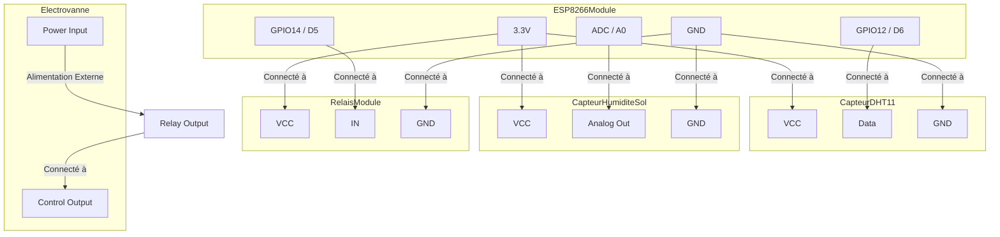

# Agrisense - Système de Surveillance IoT pour l'Agriculture

## Introduction

Le projet Agrisense - Partie IoT vise à créer un système de surveillance et de contrôle automatisé pour l'agriculture. Il utilise un microcontrôleur ESP8266 pour lire des données environnementales (température, humidité de l'air, humidité du sol) à l'aide d'un capteur DHT11 et d'un capteur d'humidité du sol. Ces données sont ensuite envoyées à une base de données Firebase en temps réel. Le système permet également de contrôler à distance un appareil (simulé par une électrovanne) via l'interface Firebase.

### Fonctionnalités Principales

*   Lecture des données de température et d'humidité de l'air via un capteur DHT11.
*   Lecture de l'humidité du sol via un capteur analogique.
*   Connexion au réseau Wi-Fi.
*   Synchronisation de l'heure via NTP.
*   Communication avec Firebase Realtime Database pour :
    *   Envoyer les mesures actuelles.
    *   Envoyer des historiques de mesures.
    *   Recevoir l'état de l'électrovanne pour le contrôle.
    *   Gérer le streaming des données de l'électrovanne.
*   Contrôle d'une électrovanne (via un relais) basée sur l'état reçu de Firebase.
*   Gestion de la reconnexion Wi-Fi et Firebase.
*   Mode de débogage via le moniteur série.

### Architecture Globale

Le système est basé sur un microcontrôleur ESP8266. Il interagit avec des capteurs physiques et communique avec un service cloud (Firebase) via Wi-Fi. Le contrôle de l'électrovanne est bidirectionnel : le système envoie des mesures et reçoit des commandes.

## Matériel

### Liste des Composants

| Composant                  | Pin ESP8266 | Fonction                                     | Notes                                       |
| :------------------------- | :---------- | :------------------------------------------- | :------------------------------------------ |
| Capteur DHT11              | D6 (GPIO12) | Mesure température et humidité de l'air      | Utilise une broche numérique.               |
| Capteur d'humidité du sol  | A0          | Mesure humidité du sol (analogique)          | Utilise une broche ADC.                     |
| Relais (pour électrovanne) | D5 (GPIO14) | Commande l'ouverture/fermeture de l'électrovanne | Piloté par un signal HIGH/LOW (LOW active). |
| ESP8266 (module)           | N/A         | Microcontrôleur principal                    | Carte type ESP12E utilisée (via PlatformIO). |

### Configuration des Pins

Les définitions des pins sont effectuées au début du fichier `src/main.cpp` :

```cpp
#define DHT_PIN 12   // Connecté à D6 sur certaines cartes de développement ESP8266
#define DHT_TYPE DHT11
#define SOIL_MOISTURE_PIN A0 // Broche analogique pour le capteur d'humidité du sol
#define RELAY_PIN 14  // Connecté à D5 sur certaines cartes de développement ESP8266
```

**Mapping :**

*   **DHT11 Data Pin:** GPIO12 (D6)
*   **Capteur Humidité Sol:** ADC Pin (A0)
*   **Relais Control Pin:** GPIO14 (D5)

### Bibliothèques et Dépendances

Le fichier `platformio.ini` liste la dépendance principale :

*   **`Firebase Arduino Client Library for ESP8266 and ESP32`** (version 4.4.17) : Permet l'interaction avec Firebase Realtime Database et l'authentification.

Les `#include` dans `src/main.cpp` indiquent les bibliothèques utilisées :

*   **`<ESP8266WiFi.h>`**: Gestion de la connexion Wi-Fi pour l'ESP8266.
*   **`<DHT.h>`**: Bibliothèque pour interagir avec les capteurs DHT (DHT11, DHT22).
*   **`<Firebase_ESP_Client.h>`**: Bibliothèque principale pour Firebase.
*   **`"time_utils.h"`**: Fichier local (non fourni dans l'extrait) pour la gestion de l'heure (NTP).
*   **`"secrets.h"`**: Fichier local (non fourni dans l'extrait) contenant les identifiants Wi-Fi et Firebase (SSID, mot de passe, clés API, email, mot de passe utilisateur).
*   **`"Array_Utils.h"`**: Fichier local (non fourni dans l'extrait) pour des utilitaires liés aux tableaux.
*   **`"addons/TokenHelper.h"`**: Module Firebase pour la gestion des tokens d'authentification.
*   **`"addons/RTDBHelper.h"`**: Module Firebase pour les opérations sur la Realtime Database.

## Schéma de Câblage



## Installation

1.  **Configuration IDE :**
    *   Utiliser **PlatformIO** avec Visual Studio Code est recommandé, comme indiqué par le `platformio.ini`.
    *   Assurez-vous que le framework Arduino pour ESP8266 est installé dans PlatformIO.
2.  **Installation des Bibliothèques :**
    *   La bibliothèque `Firebase Arduino Client Library for ESP8266 and ESP32` est spécifiée dans `platformio.ini`. PlatformIO la téléchargera automatiquement lors de la compilation.
    *   Les bibliothèques `ESP8266WiFi.h` et `DHT.h` sont généralement incluses avec le core ESP8266 pour Arduino/PlatformIO.
