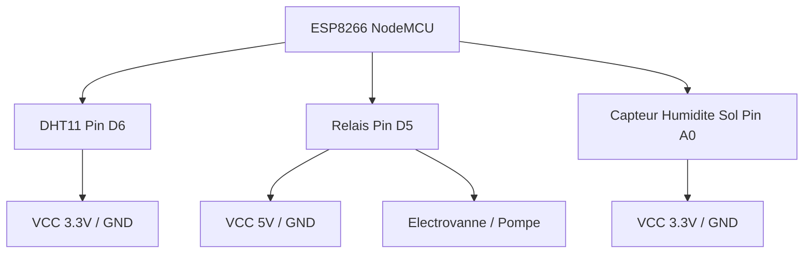

## 1. Vue d'ensemble
Ce projet, nommé **Agrisense**, est un système de surveillance agricole connectée basé sur l'ESP8266. Il permet de mesurer en temps réel la température, l'humidité de l'air et l'humidité du sol, tout en contrôlant une électrovanne via un relais. L'architecture repose sur une communication bidirectionnelle avec **Firebase Realtime Database**, utilisant le mode "Streaming" pour une réactivité immédiate aux commandes de l'utilisateur.

## 2. Composants Hardware
| Composant | Pin | Fonction | Notes |
|-----------|-----|----------|-------|
| ESP8266 (NodeMCU) | - | Microcontrôleur | Cœur du système avec WiFi intégré |
| Capteur DHT11 | 12 (D6) | Température & Humidité Air | Protocole One-Wire |
| Capteur Humidité Sol | A0 | Humidité du sol | Lecture analogique (0-1023) |
| Module Relais | 14 (D5) | Contrôle Électrovanne | Commande l'ouverture/fermeture |

## 3. Configuration des Pins
Extraits du fichier `src/main.cpp` :
```cpp
#define DHT_PIN 12   // D6 sur NodeMCU
#define DHT_TYPE DHT11
#define SOIL_MOISTURE_PIN A0
#define RELAY_PIN 14  // D5 sur NodeMCU
```

## 4. Bibliotheques
| Bibliothèque | Rôle |
|--------------|------|
| `ESP8266WiFi.h` | Gestion de la connexion au réseau local |
| `DHT.h` | Lecture des données du capteur DHT11 |
| `Firebase_ESP_Client.h` | Client complet pour Firebase (RTDB, Auth, Stream) |
| `time_utils.h` | Synchronisation temporelle via NTP |

## 5. Logique du Code
- **setup()** : Initialise les communications série, les capteurs et les pins. Connecte le WiFi, synchronise l'heure via NTP et configure l'authentification Firebase avant de lancer le flux de données (Stream).
- **loop()** : 
    1. Vérifie la persistance de la connexion WiFi et Firebase.
    2. Maintient le `FirebaseStream` actif pour intercepter les changements d'état du relais.
    3. Exécute `readMeasures()` toutes les 5 secondes.
    4. Met à jour la base de données et l'historique (toutes les 30s).
- **streamCallback()** : Fonction critique qui réagit instantanément lorsque la valeur `etat_electrovanne` est modifiée dans Firebase, déclenchant `handleRelayStateChange()`.

## 6. Schema de Cablage


## 7. Installation
1. **Environnement** : Utiliser PlatformIO sous VS Code (carte `esp12e`).
2. **Configuration** : Créer un fichier `secrets.h` avec :
   - `WIFI_SSID`, `WIFI_PASSWORD`
   - `API_KEY`, `DATABASE_URL`
   - `USER_EMAIL`, `USER_PASSWORD`
3. **Dépendances** : La bibliothèque `Firebase Arduino Client Library` (v4.4.17) s'installera via `platformio.ini`.
4. **Flash** : Connecter l'ESP8266 et lancer `Upload`.

## 8. Tests et Depannage
- **Bug Critique (Logique Relais)** : Le code initialise le relais à `HIGH` (fermé). Vérifiez si votre module relais est "Active Low" ou "Active High". Si l'électrovanne s'inverse, modifiez la logique dans `handleRelayStateChange`.
- **Avertissement WiFi** : Si le signal RSSI est faible (visible dans le Serial Monitor), le flux Firebase peut se déconnecter. Le code prévoit une reconnexion automatique après 5s.
- **Avertissement Capteur Sol** : La valeur est mappée de 0-1023 vers 0-100%. Calibrez les valeurs `0` (sec) et `1023` (immersion totale) selon votre capteur spécifique.
- **Shopping List** :
| Composant | Prix (USD) | Liens d'Achat | Alternatives |
|-----------|-------------|----------------|---------------|
| **DHT22** | **$8.90** | [Mouser ($8.90)](https://www.mouser.fr/ProductDetail/DFRobot/SEN0137) • [Adafruit ($9.95)](https://www.adafruit.com/product/385) | DHT11, AHT20 |
| **ESP32** | **$13.66** | [Mouser ($13.66)](https://www.mouser.fr/ProductDetail/Espressif/ESP32-S3-DevKitC-1-N32R16V) • [Espressif Systems (via Amazon US) ($N/A)](https://www.amazon.com/Espressif-ESP32-S3-DevKitC-1-N8R8-Development-Board/dp/B0BP3Y97X5) | ESP32-S2, ESP32-C3 |
| **ESP8266** | **$5.00** | [Amazon FR (generic NodeMCU) ($5.00-10.00)](https://www.amazon.fr/NodeMcu-ESP8266-ESP-12E-Module-Carte/dp/B073F1C4R2) • [AliExpress (generic NodeMCU) ($2.00-7.00)](https://www.aliexpress.com/item/1005001594950462.html) | ESP32, ESP8266 ESP-01 |
| **Relay Module** | **$6.99** | [Amazon FR (4-channel 5V) ($6.99)](https://www.amazon.fr/Channel-Optocoupleur-Module-Relais-Arduino/dp/B075R32G5G) • [Amazon FR (1-channel 5V) ($4.99)](https://www.amazon.fr/ELEGOO-Channel-Optocoupleur-Module-Relais/dp/B075R32G5G) | Solid State Relay (SSR), 2-channel relay module |
**💰 Total Estimate: ~$34.55**