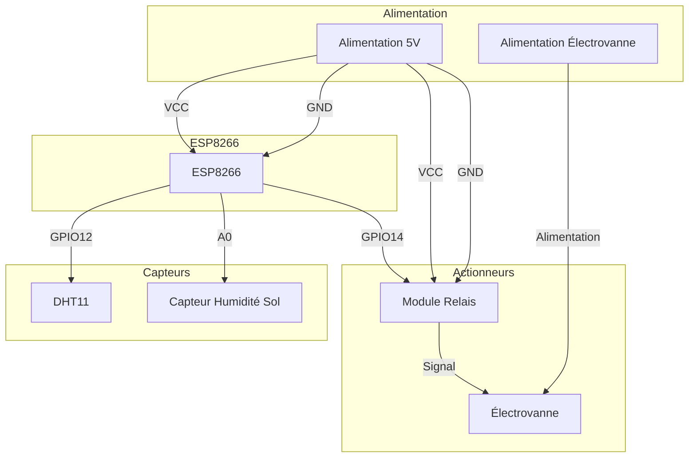

# Documentation du Projet Agrisense IoT

## 1. Vue d'ensemble

Ce projet vise à automatiser et surveiller l'irrigation d'une culture. Il mesure la température, l'humidité de l'air, l'humidité du sol et contrôle une électrovanne pour l'irrigation. Les données sont envoyées à une base de données Firebase en temps réel, et l'état de l'électrovanne peut être contrôlé à distance via Firebase. L'architecture repose sur un microcontrôleur ESP8266, des capteurs DHT11 et d'humidité du sol, et un module relais.

## 2. Composants Hardware

| Composant             | Pin ESP8266 | Fonction                 | Notes                                  |
| :-------------------- | :---------- | :----------------------- | :------------------------------------- |
| DHT11                 | D6 (GPIO12) | Capteur Température/Humidité Air | Utilise le pin 12 pour les données.    |
| Capteur Humidité Sol  | A0          | Mesure humidité du sol   | Lecture analogique sur A0.             |
| Module Relais         | D5 (GPIO14) | Contrôle de l'électrovanne | Piloté par le pin 14. LOW = Ouvert.    |
| ESP8266 (NodeMCU ESP-12E) | N/A         | Microcontrôleur          | Plateforme principale du projet.       |

## 3. Configuration des Pins

```cpp
#define DHT_PIN 12   // D6
#define DHT_TYPE DHT11
#define SOIL_MOISTURE_PIN A0
#define RELAY_PIN 14  // D5
```

## 4. Bibliothèques

*   `ESP8266WiFi.h`: Pour la connexion au réseau Wi-Fi.
*   `DHT.h`: Pour la lecture des données du capteur DHT11.
*   `Firebase_ESP_Client.h`: Bibliothèque principale pour l'interaction avec Firebase.
*   `time_utils.h`: Utilitaires pour la gestion du temps et des timestamps (NTP).
*   `secrets.h`: Contient les identifiants Wi-Fi et Firebase (non fourni dans l'extrait).
*   `Array_Utils.h`: Utilitaires pour la manipulation de tableaux (non fourni dans l'extrait).
*   `addons/TokenHelper.h`: Aide à la gestion des tokens d'authentification Firebase.
*   `addons/RTDBHelper.h`: Aide à la gestion des requêtes Realtime Database Firebase.

## 5. Logique du Code

### `setup()`
1.  Initialisation de la communication série (`Serial.begin`).
2.  Initialisation du capteur DHT (`dht.begin`).
3.  Configuration des pins: `RELAY_PIN` en sortie (initialisé à HIGH - fermé), `SOIL_MOISTURE_PIN` en entrée.
4.  Connexion au réseau Wi-Fi en utilisant les identifiants de `secrets.h`.
5.  Si la connexion Wi-Fi réussit :
    *   Initialisation de l'heure système via NTP (`initializeTimestamp`).
    *   Initialisation de Firebase (`initializeFirebase`).
    *   Pré-remplissage des tableaux d'historique avec des timestamps.
6.  Si la connexion Wi-Fi échoue, redémarrage de l'ESP.

### `loop()`
1.  Vérification périodique de la connexion Wi-Fi (`checkWiFiConnection`).
2.  Si le Wi-Fi est connecté mais Firebase n'est pas prêt, réinitialisation de Firebase (`initializeFirebase`).
3.  Vérification périodique de la connexion au stream Firebase (`checkStreamConnection`).
4.  Gestion du changement d'état de l'électrovanne (`handleRelayStateChange`).
5.  Toutes les `MEASURE_INTERVAL` millisecondes :
    *   Lecture des mesures des capteurs (`readMeasures`).
    *   Mise à jour de la base de données Firebase (`updateDataBase`) si Firebase est prêt.
6.  Lecture continue du stream Firebase (`Firebase.RTDB.readStream`) pour maintenir la connexion active et recevoir les mises à jour.
7.  Un court délai (`delay(50)`) pour améliorer la réactivité.

### Fonctions Critiques
*   `initializeFirebase()`: Configure et démarre la connexion à Firebase, y compris l'authentification et la configuration des callbacks.
*   `startFirebaseStream()`: Démarre le flux de données en temps réel depuis Firebase pour surveiller les changements, notamment l'état de l'électrovanne.
*   `streamCallback()`: Fonction appelée lors de la réception de données via le stream Firebase. Elle met à jour l'état de `RELAY_STATE` si le champ `/etat_electrovanne` change.
*   `checkStreamConnection()`: Vérifie la santé du stream Firebase et tente de le redémarrer si nécessaire.
*   `updateDataBase()`: Envoie les mesures actuelles et l'état de l'électrovanne à Firebase Realtime Database, et met à jour les données d'historique.
*   `handleRelayStateChange()`: Applique physiquement le changement d'état de l'électrovanne en fonction de la variable `RELAY_STATE`.

## 6. Schema de Cablage



## 7. Installation

1.  **Configuration IDE**: Assurez-vous d'avoir PlatformIO installé dans votre IDE (VS Code recommandé) ou l'IDE Arduino avec le support ESP8266.
2.  **Installation des bibliothèques**:
    *   Via PlatformIO : La bibliothèque `Firebase Arduino Client Library for ESP8266 and ESP32` est spécifiée dans `platformio.ini`. PlatformIO l'installera automatiquement.
    *   Via IDE Arduino : Installez manuellement les bibliothèques : `ESP8266WiFi`, `DHT sensor library`, `Firebase Arduino Client Library for ESP8266 and ESP32`, et les add-ons Firebase (`TokenHelper`, `RTDBHelper`). Les bibliothèques `time_utils.h`, `secrets.h`, et `Array_Utils.h` doivent être ajoutées manuellement au projet.
3.  **Configuration des identifiants**: Créez un fichier `secrets.h` à la racine du projet (ou dans `src/`) avec le contenu suivant (adaptez avec vos propres informations) :
    ```cpp
    #ifndef SECRETS_H
    #define SECRETS_H

    #define WIFI_SSID "VOTRE_SSID_WIFI"
    #define WIFI_PASSWORD "VOTRE_MOT_DE_PASSE_WIFI"

    #define API_KEY "VOTRE_API_KEY_FIREBASE"
    #define DATABASE_URL "https://VOTRE_PROJET_FIREBASE.firebaseio.com/" // Sans le '/' final
    #define USER_EMAIL "votre_email@example.com"
    #define USER_PASSWORD "votre_mot_de_passe_firebase"

    #endif
    ```
4.  **Compilation et Upload**:
    *   Sélectionnez la bonne carte (`esp12e`) dans la configuration de votre IDE.
    *   Compilez le projet.
    *   Téléversez le code sur votre ESP8266.

## 8. Tests et Depannage

*   **Serial Monitor**: Surveillez la sortie du moniteur série (115200 bauds) pour les messages de débogage, les erreurs de connexion Wi-Fi/Firebase, et les valeurs des capteurs.
*   **Connexion Wi-Fi**: Vérifiez que les identifiants `WIFI_SSID` et `WIFI_PASSWORD` dans `secrets.h` sont corrects. Redémarrez l'ESP si la connexion échoue après plusieurs tentatives.
*   **Connexion Firebase**: Assurez-vous que `API_KEY`, `DATABASE_URL`, `USER_EMAIL`, et `USER_PASSWORD` sont corrects dans `secrets.h`. Vérifiez que votre projet Firebase est configuré pour permettre l'authentification par email/mot de passe et que les règles de sécurité autorisent les écritures. Le `DATABASE_URL` ne doit pas contenir de slash final.
*   **Fonctionnement des Capteurs**:
    *   **DHT11**: Vérifiez le câblage. Des lectures `NaN` indiquent un problème de connexion ou un capteur défectueux. Le code gère ces erreurs en affichant un message et en utilisant des valeurs par défaut (-1).
    *   **Humidité Sol**: Vérifiez le câblage. Une lecture constante de 0 ou 100% peut indiquer un problème de câblage ou un capteur mal calibré/défectueux. La fonction `map` tente de convertir la lecture brute en pourcentage (0-100).
*   **Fonctionnement Relais**: Vérifiez le câblage du module relais et de l'électrovanne. Le code contrôle le relais en envoyant un signal `LOW` pour l'ouvrir et `HIGH` pour le fermer. Assurez-vous que l'alimentation du relais et de l'électrovanne est correcte.
*   **Stream Firebase**: Si le stream ne fonctionne pas, vérifiez la connexion réseau et l'état de Firebase. Le code tente de redémarrer le stream si une déconnexion est détectée ou si un timeout survient. Une erreur `401` ou `403` lors de la lecture du stream peut indiquer un problème de token d'authentification, nécessitant une réinitialisation de la connexion Firebase.

**Bugs Détectés et Solutions:**

1.  **Critique**: Le code utilise `ESP8266WiFi.h` et la carte `esp12e` est spécifiée dans `platformio.ini`, mais les bibliothèques Firebase et les fonctions de temps (`time_utils.h`) sont souvent associées à l'ESP32. Bien que l'ESP8266 puisse utiliser certaines de ces bibliothèques, il y a un risque d'incompatibilité ou de fonctionnalités limitées.
    *   **Solution**: Vérifier la compatibilité exacte de la version de `Firebase_ESP_Client` utilisée avec l'ESP8266. Si des problèmes surviennent, envisager de passer à une plateforme ESP32 (comme spécifié dans la liste des dépendances de `platformio.ini` qui mentionne "ESP8266 and ESP32") ou d'utiliser une bibliothèque Firebase spécifiquement pour ESP8266 si disponible et plus stable.

2.  **Avertissement**: Le fichier `secrets.h` est inclus mais son contenu n'est pas fourni. Les utilisateurs doivent le créer manuellement avec leurs propres identifiants.
    *   **Solution**: Fournir un exemple de structure pour `secrets.h` dans la section Installation, comme fait dans cette documentation.

3.  **Avertissement**: La bibliothèque `Array_Utils.h` est incluse mais non fournie dans l'extrait de code. Son rôle exact n'est pas clair sans le code source correspondant.
    *   **Solution**: S'assurer que le fichier `Array_Utils.h` est présent dans le projet et contient les fonctions nécessaires au bon fonctionnement du code, notamment pour la gestion des tableaux d'historique.

---

## 🛒 Liste de Courses

| Composant | Prix (USD) | Liens d'Achat | Alternatives |
|-----------|-------------|----------------|---------------|
| **DHT22** | **$8.90** | [Mouser ($8.90)](https://www.mouser.fr/ProductDetail/DFRobot/SEN0137?qs=sGAEpiMZZMuk0R3xJ2WvUxJ8L0T80a1w5) • [Gotronic ($10.90)](https://www.gotronic.fr/art-capteur-de-t-et-d-humidite-dht22-32332.htm) | DHT11, AHT20 |
| **ESP32** | **$5.00** | [Mouser ($4.75)](https://www.mouser.fr/ProductDetail/Espressif-Systems/ESP32-C6FH8?qs=sGAEpiMZZMuk0R3xJ2WvUxJ8L0T80a1w5) • [Amazon ($6.99)](https://www.amazon.fr/ESP32-Module-d%C3%A9veloppement-ESP-WROOM-32D-Bluetooth/dp/B08DQQ8CBP) | ESP32-S2, ESP32-C3 |
| **ESP8266** | **$3.50** | [Mouser ($1.60)](https://www.mouser.fr/ProductDetail/Espressif-Systems/ESP8266EX?qs=sGAEpiMZZMunkfF8205314hG6Xl5fMv5) • [Amazon ($5.99)](https://www.amazon.fr/ESP8266-ESP-12E-NodeMCU-Module-d%C3%A9veloppement/dp/B071P98V1L) | ESP32, Raspberry Pi Pico W |
| **Relay Module** | **$5.00** | [Amazon ($6.99)](https://www.amazon.fr/AZDelivery-Relais-Canaux-Optocoupleur-Compatible/dp/B07R46R77L) • [ElectroPeak ($0.84)](https://electropeak.com/products/2-channel-relay-module-5v) | Solid State Relay (SSR), Optocoupler |

**💰 Total Estimate: ~$22.40**