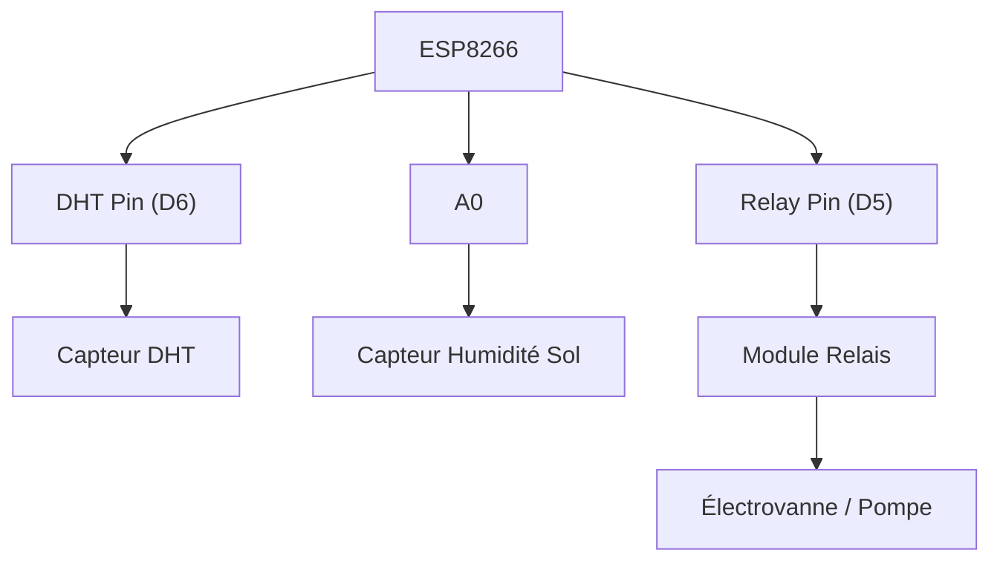

## 1. Vue d'ensemble

Ce projet vise à automatiser la gestion de l'irrigation et la surveillance environnementale pour les cultures. Il mesure la température, l'humidité de l'air, l'humidité du sol et contrôle un relais (probablement pour une électrovanne ou une pompe) en fonction des données collectées et des commandes reçues via Firebase. L'architecture matérielle repose sur un ESP8266, un capteur DHT et un capteur d'humidité du sol. Le logiciel utilise le framework Arduino, se connecte au WiFi, synchronise l'heure via NTP, et communique avec Firebase Realtime Database pour envoyer des mesures, recevoir des commandes et stocker des historiques.

## 2. Composants Hardware

| Composant           | Pin ESP8266 | Fonction                               | Notes                                                              |
| :------------------ | :---------- | :------------------------------------- | :----------------------------------------------------------------- |
| ESP8266 (ESP-12E)   |             | Microcontrôleur                        | Carte principale                                                   |
| DHT Sensor          | D6 (GPIO12) | Mesure température et humidité de l'air | Le code spécifie DHT11, mais le composant détecté est DHT22.      |
| Capteur Humidité Sol| A0          | Mesure l'humidité du sol               | Lecture analogique                                                 |
| Module Relais       | D5 (GPIO14) | Commande de l'électrovanne/pompe       | Piloté par le GPIO14, LOW active le relais (électrovanne ouverte). |

## 3. Configuration des Pins

```cpp
#define DHT_PIN 12   // D6
#define DHT_TYPE DHT11
#define SOIL_MOISTURE_PIN A0
#define RELAY_PIN 14  // D5
```

## 4. Bibliothèques

| Bibliothèque                 | Rôle                                                                 |
| :--------------------------- | :------------------------------------------------------------------- |
| `ESP8266WiFi.h`              | Gestion de la connexion WiFi sur ESP8266.                            |
| `DHT.h`                      | Interface avec les capteurs DHT (DHT11, DHT22).                      |
| `Firebase_ESP_Client.h`      | Communication avec Firebase Realtime Database.                       |
| `"time_utils.h"`             | Fonctions utilitaires pour la gestion du temps et la synchronisation NTP. |
| `"secrets.h"`                | Stockage des identifiants WiFi et Firebase (non fourni dans l'extrait). |
| `"Array_Utils.h"`            | Fonctions utilitaires pour la manipulation de tableaux (non fourni). |
| `addons/TokenHelper.h`       | Gestion des tokens d'authentification Firebase.                      |
| `addons/RTDBHelper.h`        | Fonctions spécifiques pour Firebase Realtime Database.               |

## 5. Logique du Code

*   **`setup()`**:
    *   Initialise la communication série (`Serial.begin`).
    *   Initialise le capteur DHT (`dht.begin()`).
    *   Configure la broche du relais en sortie et l'initialise à l'état HAUT (relais inactif, électrovanne fermée).
    *   Configure la broche d'humidité du sol en entrée.
    *   Tente la connexion au réseau WiFi en utilisant les identifiants de `secrets.h`.
    *   Si la connexion WiFi réussit :
        *   Initialise l'heure système via NTP (`initializeTimestamp()`).
        *   Initialise la connexion à Firebase (`initializeFirebase()`).
        *   Prépare les tableaux d'historique avec des timestamps initiaux.
    *   Si la connexion WiFi échoue, redémarre l'ESP8266.

*   **`loop()`**:
    *   Vérifie périodiquement la connexion WiFi et tente de la rétablir si nécessaire (`checkWiFiConnection()`).
    *   Si le WiFi est connecté mais Firebase n'est pas prêt, réinitialise la connexion Firebase (`initializeFirebase()`).
    *   Vérifie l'état du stream Firebase et tente de le redémarrer si nécessaire (`checkStreamConnection()`).
    *   Traite les changements d'état du relais demandés par Firebase (`handleRelayStateChange()`).
    *   Toutes les `MEASURE_INTERVAL` millisecondes (5 secondes) :
        *   Lit les mesures des capteurs (`readMeasures()`).
        *   Met à jour les données dans Firebase Realtime Database (`updateDataBase()`).
    *   Lit en continu le stream Firebase pour recevoir les mises à jour (`Firebase.RTDB.readStream()`).
    *   Attend brièvement (`delay(50)`) pour éviter de saturer le processeur.

*   **Fonctions Critiques**:
    *   `initializeFirebase()`: Gère la configuration et l'authentification Firebase, y compris la gestion des tokens et le démarrage du stream.
    *   `startFirebaseStream()`: Démarre l'écoute des changements sur le nœud `dernieres_mesures` dans Firebase.
    *   `streamCallback()`: Fonction de rappel appelée lors de la réception de données via le stream Firebase. Elle est utilisée pour mettre à jour l'état de l'électrovanne (`RELAY_STATE`).
    *   `readMeasures()`: Lit les valeurs des capteurs DHT et d'humidité du sol, effectue une mise à l'échelle pour l'humidité du sol et gère les erreurs de lecture du DHT.
    *   `updateDataBase()`: Envoie les mesures actuelles et l'état du relais à Firebase, et met à jour périodiquement les données d'historique.
    *   `handleRelayStateChange()`: Applique le changement d'état du relais au GPIO physique lorsque `RELAY_STATE_CHANGED` est vrai.

## 6. Schéma de Câblage



## 7. Installation

1.  **Configuration de l'IDE**: Assurez-vous d'avoir PlatformIO installé dans votre éditeur de code (VS Code recommandé) ou l'IDE Arduino avec le support ESP8266.
2.  **Installation des Bibliothèques**:
    *   **PlatformIO**: Ajoutez les bibliothèques spécifiées dans `platformio.ini` à votre fichier `lib_deps`. La bibliothèque principale est `Firebase Arduino Client Library for ESP8266 and ESP32`. Les autres (`time_utils.h`, `secrets.h`, `Array_Utils.h`) doivent être ajoutées manuellement dans le dossier `src/` ou `include/` du projet.
    *   **Arduino IDE**: Installez les bibliothèques via le Gestionnaire de Bibliothèques :
        *   "Firebase Arduino Client Library for ESP8266 and ESP32" par mobitar.
        *   "DHT sensor library" par Adafruit.
        *   "ESP8266WiFi" (généralement inclus avec le package ESP8266).
        *   Les fichiers `time_utils.h`, `secrets.h`, `Array_Utils.h` doivent être placés dans le même répertoire que le fichier `.ino` ou dans un sous-dossier `src/`.
3.  **Configuration des Identifiants**: Modifiez le fichier `secrets.h` (à créer s'il n'existe pas) pour y inclure vos informations de connexion WiFi et Firebase :
    ```cpp
    // secrets.h
    #ifndef SECRETS_H
    #define SECRETS_H

    // WiFi
    const char* WIFI_SSID = "VOTRE_SSID_WIFI";
    const char* WIFI_PASSWORD = "VOTRE_MOT_DE_PASSE_WIFI";

    // Firebase
    const char* API_KEY = "VOTRE_API_KEY";
    const char* DATABASE_URL = "VOTRE_DATABASE_URL"; // Ex: "https://votre-projet-id.firebaseio.com/"
    const char* USER_EMAIL = "VOTRE_EMAIL_FIREBASE";
    const char* USER_PASSWORD = "VOTRE_MOT_DE_PASSE_FIREBASE";

    #endif
    ```
4.  **Compilation et Upload**:
    *   **PlatformIO**: Ouvrez le projet dans VS Code, sélectionnez l'environnement `esp12e` et cliquez sur le bouton "Upload".
    *   **Arduino IDE**: Sélectionnez la bonne carte (NodeMCU 1.0 ou ESP-12E Module) et le port COM approprié, puis cliquez sur le bouton "Upload".

## 8. Tests et Dépannage

*   **Shopping List**:
    *   ESP8266 (module ESP-12E)
    *   Capteur DHT22 (détecté, bien que le code spécifie DHT11)
    *   Module Relais 5V
    *   Capteur d'humidité du sol (type analogique)
    *   Alimentation pour l'ESP8266 et les modules.
    *   Fils de connexion.

*   **Points de Contrôle Hardware**:
    *   Vérifiez que le capteur DHT est correctement câblé (VCC, GND, Data vers GPIO12).
    *   Assurez-vous que le capteur d'humidité du sol est connecté à A0 et GND/VCC.
    *   Confirmez que le module relais est alimenté et que son signal d'entrée est connecté à GPIO14. La charge connectée au relais doit être compatible avec sa capacité.

*   **Vérifications Serial Monitor**:
    *   Surveillez la sortie du `Serial Monitor` (configuré à 115200 bauds) pendant le démarrage pour observer les étapes de connexion WiFi et Firebase.
    *   Recherchez les messages "[DEBUG]" pour suivre le flux d'exécution et les valeurs des capteurs.
    *   Notez toute erreur signalée par Firebase (`fbdo.errorReason()`) ou lors de la lecture du stream.

*   **Erreurs Courantes et Solutions**:
    *   **Bug Critique**: Le code spécifie `DHT_TYPE DHT11` mais le composant détecté est un `DHT22`. Bien que souvent compatibles, les lectures peuvent être moins précises.
        *   **Solution**: Changez `#define DHT_TYPE DHT11` en `#define DHT_TYPE DHT22` dans `src/main.cpp` pour une meilleure précision.
    *   **Avertissement**: Le code utilise `digitalWrite(RELAY_PIN, RELAY_STATE ? LOW : HIGH);`. Cela signifie que `RELAY_STATE = true` (logique) correspond à `LOW` (électrique), activant le relais. L'état initial est `HIGH` (inactif). Si l'électrovanne doit être ouverte par défaut, cette logique est correcte, mais il faut être conscient que `true` signifie "ouvert" et `false` signifie "fermé".
        *   **Solution**: Documentez clairement cette inversion logique dans l'interface utilisateur ou le système de contrôle Firebase.
    *   **Avertissement**: La fonction `readMeasures` utilise `map(constrain(soil_moisture_raw, 0, 1023), 0, 1023, 0, 100);`. La plage de lecture `analogRead` sur ESP8266 est généralement de 0 à 1023. Cependant, la calibration du capteur d'humidité du sol peut nécessiter des valeurs minimales et maximales différentes de 0 et 1023 pour représenter respectivement le sol complètement sec et complètement saturé.
        *   **Solution**: Calibrez le capteur en mesurant les valeurs dans un sol sec et un sol saturé, puis ajustez les bornes de la fonction `map` en conséquence. Par exemple : `map(constrain(soil_moisture_raw, 200, 800), 200, 800, 0, 100);` après avoir déterminé les valeurs min/max réelles.
    *   **Perte de connexion WiFi/Firebase**: Si l'appareil perd la connexion, il tente de la rétablir. Vérifiez les logs pour les échecs de connexion. Assurez-vous que les identifiants WiFi et Firebase dans `secrets.h` sont corrects et que le réseau est accessible.
    *   **Problèmes de Stream Firebase**: Si le stream ne fonctionne pas, vérifiez la configuration Firebase (URL, clés API), l'authentification utilisateur, et assurez-vous que le chemin `/cultures/dernieres_mesures` ou `/test_data/dernieres_mesures` existe dans votre base de données. Le redémarrage périodique du stream (`checkStreamConnection`) aide à maintenir la connexion active. Les erreurs HTTP 401/403 lors de la lecture du stream indiquent souvent un problème de token d'authentification expiré ou invalide, nécessitant une réinitialisation de la connexion Firebase.