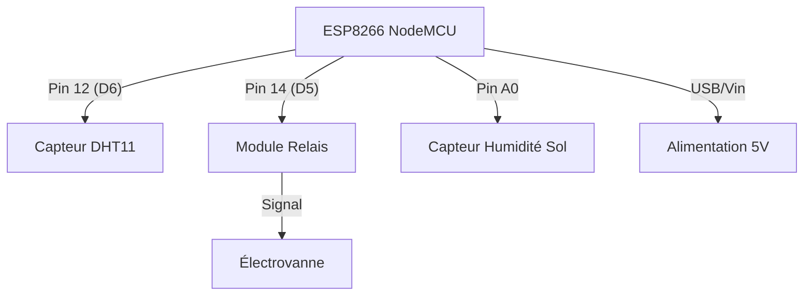

## 1. Vue d'ensemble
Ce projet, nommé **Agrisense**, est un système de monitoring agricole intelligent basé sur l'ESP8266. Il permet de mesurer en temps réel la température, l'humidité de l'air et l'humidité du sol, tout en contrôlant une électrovanne à distance via une base de données Firebase Realtime Database. L'architecture repose sur une communication bidirectionnelle : l'envoi de données capteurs et l'écoute (streaming) de commandes pour l'actionneur.

## 2. Composants Hardware
| Composant | Pin | Fonction | Notes |
| :--- | :--- | :--- | :--- |
| ESP8266 (NodeMCU) | - | Microcontrôleur principal | Gère WiFi et logique |
| Capteur DHT11 | 12 (D6) | Température & Humidité air | Protocole One-Wire |
| Capteur Humidité Sol | A0 | Humidité de la terre | Lecture analogique (0-1023) |
| Module Relais | 14 (D5) | Commande Électrovanne | Pilotage en logique inversée |

## 3. Configuration des Pins
Extraits du fichier `src/main.cpp` :
```cpp
#define DHT_PIN 12             // Broche D6
#define DHT_TYPE DHT11         // Type de capteur
#define SOIL_MOISTURE_PIN A0   // Entrée analogique
#define RELAY_PIN 14           // Broche D5
```

## 4. Bibliotheques
| Bibliothèque | Rôle |
| :--- | :--- |
| `ESP8266WiFi.h` | Gestion de la connectivité sans fil |
| `DHT.h` | Lecture des données du capteur DHT11 |
| `Firebase_ESP_Client.h` | Client pour Firebase RTDB et authentification |
| `time_utils.h` | Gestion du temps et synchronisation NTP |
| `Array_Utils.h` | Utilitaires pour la manipulation des tableaux de données |

## 5. Logique du Code
*   **setup()** : Initialise le port série, les broches (Relais en `OUTPUT`, DHT en `begin`), se connecte au WiFi, synchronise l'heure via NTP et configure la connexion Firebase.
*   **loop()** : 
    1. Vérifie la connexion WiFi et Firebase.
    2. Maintient le flux de données (Stream) actif pour réagir instantanément aux changements sur Firebase.
    3. Lit les capteurs toutes les 5 secondes (`MEASURE_INTERVAL`).
    4. Met à jour les données en temps réel et l'historique (toutes les 30s) sur Firebase.
*   **streamCallback()** : Fonction critique qui intercepte les modifications de la variable `etat_electrovanne` sur Firebase pour actionner le relais immédiatement sans attendre la fin de la boucle.

## 6. Schema de Cablage


## 7. Installation
1.  **IDE** : Utiliser VS Code avec l'extension **PlatformIO**.
2.  **Configuration** : Créer un fichier `src/secrets.h` pour définir `WIFI_SSID`, `WIFI_PASSWORD`, `API_KEY`, `DATABASE_URL`, `USER_EMAIL` et `USER_PASSWORD`.
3.  **Dépendances** : PlatformIO installera automatiquement `Firebase Arduino Client Library` (v4.4.17) via le fichier `platformio.ini`.
4.  **Upload** : Connecter l'ESP8266 et lancer la compilation/téléchargement (`PIO Run --target upload`).

## 8. Tests et Depannage
*   **Moniteur Série** : Vérifier que le message "Firebase initialisé avec succès" apparaît à 115200 bauds.
*   **Synchronisation** : Si le timestamp reste à zéro, vérifier l'accès au serveur NTP (port 123).
*   **Bugs Détectés & Solutions** :
    1.  **Bug Critique** : Chute de tension lors de l'activation du relais. *Solution* : Utiliser une alimentation externe pour le module relais et ne pas compter uniquement sur le port USB de l'ESP8266.
    2.  **Avertissement** : Oxydation rapide du capteur d'humidité du sol résistif. *Solution* : Remplacer par un capteur capacitif pour une meilleure longévité.
    3.  **Avertissement** : Déconnexion du Stream Firebase. *Solution* : Le code inclut déjà une vérification `checkStreamConnection()` toutes les 5 secondes pour relancer le flux en cas de coupure.

## 🛒 Liste de Courses

| Composant | Prix (USD) | Liens d'Achat | Alternatives |
|-----------|-------------|----------------|---------------|
| **DHT22** | **$8.99** | [Gotronic ($10.90)](https://www.gotronic.fr/art-capteur-de-t-et-d-humidite-dht22-32332.htm) • [eBay ($6.99)](https://www.ebay.com/sch/i.html?_nkw=DHT22+module) | DHT11, AHT20 |
| **ESP32** | **$6.99** | [Walmart ($4.47 (for 5-pack))](https://www.walmart.com/search?q=ESP32+development+board) • [eBay ($4.99 - 9.95 (typical dev board))](https://www.ebay.com/sch/i.html?_nkw=ESP32+development+board) | ESP32-S2, ESP32-C3 |
| **ESP8266** | **$8.49** | [Mouser ($9.95)](https://www.mouser.fr/ProductDetail/Adafruit/2471) • [AZ-Delivery ($7.55 (6.99€))](https://www.az-delivery.fr/products/nodemcu-lua-amica-modul-v2-esp8266-esp-12f-wifi-development-board-mit-cp2102) | ESP32, ESP32-WROOM-32E |
| **Relay Module** | **$3.00** | [Gotronic ($4.10 (3.80€))](https://www.gotronic.fr/art-module-relais-5-v-gt1080-35226.htm) • [Gotronic (Alternative) ($4.64 (4.30€))](https://www.gotronic.fr/art-module-relais-5-vcc-333024-38612.htm) | Solid State Relay (SSR), MOSFET module |

**💰 Total Estimate: ~$27.47**