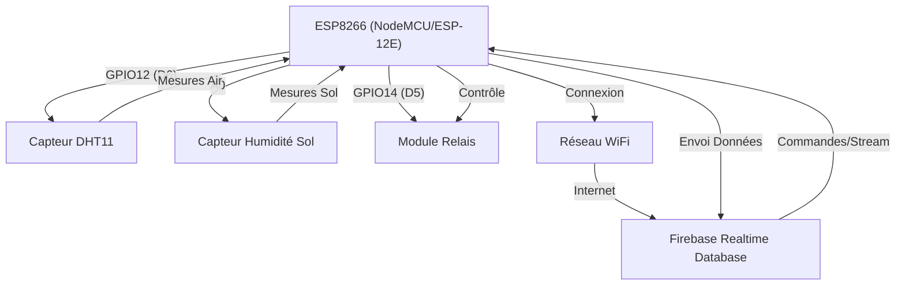

## 1. Vue d'ensemble
Ce projet vise à créer un système de surveillance et de contrôle intelligent pour l'agriculture, permettant de mesurer l'humidité de l'air, la température, et l'humidité du sol. Il intègre un module relais pour contrôler un dispositif d'irrigation (comme une électrovanne). L'architecture repose sur un microcontrôleur ESP8266 qui collecte les données des capteurs et les transmet en temps réel à une base de données Firebase. Le système peut également recevoir des commandes de Firebase pour activer ou désactiver le relais, offrant ainsi un contrôle à distance.

## 2. Composants Hardware
| Composant               | Pin        | Fonction                                   | Notes                                                              |
| :---------------------- | :--------- | :----------------------------------------- | :----------------------------------------------------------------- |
| ESP8266 (ESP-12E)       | -          | Microcontrôleur principal                  | Gère la logique, les capteurs, le WiFi et Firebase.                |
| Capteur DHT11           | GPIO12 (D6) | Mesure la température et l'humidité de l'air | Connecté à la broche numérique D6.                                 |
| Capteur Humidité du Sol | A0         | Mesure l'humidité du sol                   | Capteur analogique, connecté à la broche analogique A0.            |
| Module Relais           | GPIO14 (D5) | Contrôle l'électrovanne                    | Connecté à la broche numérique D5.                                 |

## 3. Configuration des Pins
Le code définit les broches utilisées pour les différents composants :
```cpp
#define DHT_PIN 12   // D6
#define DHT_TYPE DHT11
#define SOIL_MOISTURE_PIN A0
#define RELAY_PIN 14  // D5
```

## 4. Bibliothèques
Les bibliothèques suivantes sont utilisées dans le projet :
*   `ESP8266WiFi.h`: Gère la connectivité Wi-Fi de l'ESP8266.
*   `DHT.h`: Interface avec le capteur DHT11 pour la lecture de la température et de l'humidité de l'air.
*   `Firebase_ESP_Client.h`: Bibliothèque principale pour interagir avec Firebase Realtime Database.
*   `time_utils.h`: Fournit des fonctions utilitaires pour l'initialisation et la gestion du temps (NTP) et la génération d'horodatages UTC.
*   `secrets.h`: Contient les identifiants sensibles (SSID Wi-Fi, mot de passe, clés API Firebase, URL de la base de données, identifiants utilisateur).
*   `Array_Utils.h`: Bibliothèque utilitaire pour la manipulation de tableaux (non directement visible dans `main.cpp` pour les tableaux globaux, mais peut être utilisée par d'autres fonctions).
*   `addons/TokenHelper.h`: Aide à la gestion des tokens d'authentification Firebase.
*   `addons/RTDBHelper.h`: Fournit des fonctions d'aide pour l'utilisation du Realtime Database de Firebase.

## 5. Logique du Code
Le programme initialise les composants et gère la communication avec Firebase en continu.

*   **`setup()`**:
    *   Initialise la communication série à 115200 bauds.
    *   Configure les broches du DHT11, du capteur d'humidité du sol et du relais. Le relais est initialisé en position "fermée" (`HIGH`).
    *   Établit la connexion Wi-Fi en utilisant les identifiants de `secrets.h`.
    *   Initialise le temps via NTP (`initializeTimestamp()`) pour des horodatages précis.
    *   Initialise la connexion à Firebase (`initializeFirebase()`).
    *   Prépare les tableaux d'historique avec des horodatages initiaux.

*   **`loop()`**:
    *   Vérifie et maintient la connexion Wi-Fi (`checkWiFiConnection()`).
    *   Si la connexion Firebase est perdue, tente de la réinitialiser.
    *   Vérifie et redémarre le stream Firebase régulièrement (`checkStreamConnection()`) pour écouter les changements.
    *   Gère les changements d'état du relais (`handleRelayStateChange()`) si une commande est reçue via Firebase.
    *   À intervalles réguliers (5 secondes, `MEASURE_INTERVAL`), lit les données des capteurs (`readMeasures()`) et les envoie à Firebase (`updateDataBase()`).
    *   Lit en continu le stream Firebase pour assurer la réactivité aux commandes.

*   **Fonctions critiques**:
    *   `initializeFirebase()`: Configure les informations d'authentification et de base de données Firebase, puis établit la connexion et démarre le stream.
    *   `startFirebaseStream()`: Démarre un flux de données en temps réel depuis Firebase pour écouter les changements, notamment l'état de l'électrovanne.
    *   `streamCallback()`: Fonction de rappel déclenchée par le stream Firebase. Elle met à jour l'état du relais (`RELAY_STATE`) si le champ `/etat_electrovanne` change dans la base de données.
    *   `readMeasures()`: Lit les valeurs de température et d'humidité de l'air du DHT11, ainsi que l'humidité du sol via la broche analogique A0.
    *   `updateDataBase()`: Envoie les dernières mesures (température, humidité air/sol, état du relais, horodatage) à la section `/dernieres_mesures` de Firebase. Met également à jour un historique des données dans `/historiques` toutes les 30 secondes.

## 6. Schéma de Câblage


## 7. Installation
Pour installer et exécuter ce projet, suivez les étapes ci-dessous :

1.  **Installer PlatformIO IDE**: Assurez-vous d'avoir Visual Studio Code avec l'extension PlatformIO IDE installée.
2.  **Cloner le dépôt**: Ouvrez un terminal et clonez le dépôt GitHub :
    ```bash
    git clone https://github.com/leadertgn/agrisense-partie-iot.git
    cd agrisense-partie-iot
    ```
3.  **Créer le fichier `secrets.h`**: Dans le dossier `src`, créez un nouveau fichier nommé `secrets.h` et ajoutez-y vos identifiants Wi-Fi et Firebase. Remplacez les valeurs d'exemple par les vôtres :
    ```cpp
    #ifndef SECRETS_H
    #define SECRETS_H

    #define WIFI_SSID "Votre_SSID_WiFi"
    #define WIFI_PASSWORD "Votre_MotDePasse_WiFi"

    #define API_KEY "Votre_Cle_API_Firebase"
    #define DATABASE_URL "https://votre-projet-firebase.firebaseio.com/" // URL de votre Realtime Database
    #define USER_EMAIL "votre_email@example.com"
    #define USER_PASSWORD "Votre_MotDePasse_Firebase"

    #endif
    ```
4.  **Vérifier les dépendances**: Le fichier `platformio.ini` spécifie les bibliothèques nécessaires. PlatformIO les installera automatiquement lors de la première compilation.
    ```ini
    lib_deps =
      Firebase Arduino Client Library for ESP8266 and ESP32@4.4.17
    ```
5.  **Compiler et Téléverser**: Connectez votre carte ESP8266 à votre ordinateur via USB. Dans VS Code, utilisez les boutons de PlatformIO (coche pour compiler, flèche pour téléverser) pour compiler le code et le téléverser sur votre ESP8266.

## 8. Tests et Dépannage
Voici des points de contrôle et des solutions pour les problèmes potentiels :

*   **Bugs Hardware Détectés :**
    1.  **Critique - Type de Capteur DHT**: Le code définit `DHT_TYPE DHT11` mais la liste des composants détectés mentionne un `DHT22`.
        *   **Solution**: Si un capteur DHT22 est réellement utilisé, modifiez la ligne `#define DHT_TYPE DHT11` en `#define DHT_TYPE DHT22` dans `src/main.cpp` pour assurer des lectures précises.
    2.  **Avertissement - Logique du Relais**: Le relais est initialisé avec `digitalWrite(RELAY_PIN, HIGH);` pour le fermer par défaut. Cela suppose un module relais "actif à l'état bas" (où un signal LOW active le relais et HIGH le désactive).
        *   **Solution**: Vérifiez le type de votre module relais. Si c'est un module "actif à l'état haut", vous devrez inverser la logique dans le code (par exemple, `digitalWrite(RELAY_PIN, LOW);` pour fermer par défaut, et inverser les `LOW`/`HIGH` dans `handleRelayStateChange()`).
    3.  **Avertissement - Durée de Vie du Capteur d'Humidité du Sol**: Les capteurs d'humidité du sol résistifs analogiques ont une durée de vie limitée lorsqu'ils sont alimentés en continu dans un environnement humide.
        *   **Solution**: Pour prolonger la durée de vie du capteur, il est fortement recommandé de ne l'alimenter que pendant la lecture. Connectez la broche VCC du capteur à une broche GPIO numérique de l'ESP8266 (par exemple, D4), et activez cette broche (`digitalWrite(D4, HIGH);`) juste avant de lire le capteur, puis désactivez-la (`digitalWrite(D4, LOW);`) après la lecture.

*   **Points de contrôle généraux :**
    *   **Connexion Série**: Ouvrez le moniteur série de PlatformIO (à 115200 bauds) pour visualiser les messages de débogage. Ils fournissent des informations cruciales sur l'état du Wi-Fi, de Firebase et des capteurs.
    *   **Fichier `secrets.h`**: Assurez-vous que toutes les informations (SSID, mot de passe Wi-Fi, clé API, URL de la base de données, e-mail et mot de passe utilisateur Firebase) sont correctement renseignées et correspondent à votre configuration Firebase.
    *   **Connexion Wi-Fi**: Vérifiez que l'ESP8266 se connecte correctement à votre réseau Wi-Fi. Les messages du moniteur série indiqueront l'état de la connexion et l'adresse IP attribuée.
    *   **Règles de Sécurité Firebase**: Assurez-vous que les règles de sécurité de votre base de données Firebase Realtime Database permettent la lecture et l'écriture pour les chemins `/dernieres_mesures` et `/historiques`.
    *   **Câblage**: Vérifiez toutes les connexions physiques des capteurs et du relais à l'ESP8266. Des erreurs de câblage sont une cause fréquente de problèmes.

## 9. Shopping List
Pour réaliser ce projet, vous aurez besoin des composants suivants :

*   **ESP8266** (par exemple, une carte NodeMCU ESP-12E)
*   **Capteur DHT11** (ou DHT22, en ajustant le code si nécessaire)
*   **Capteur d'humidité du sol analogique**
*   **Module relais 5V** (vérifiez la logique d'activation - actif à l'état bas ou haut)