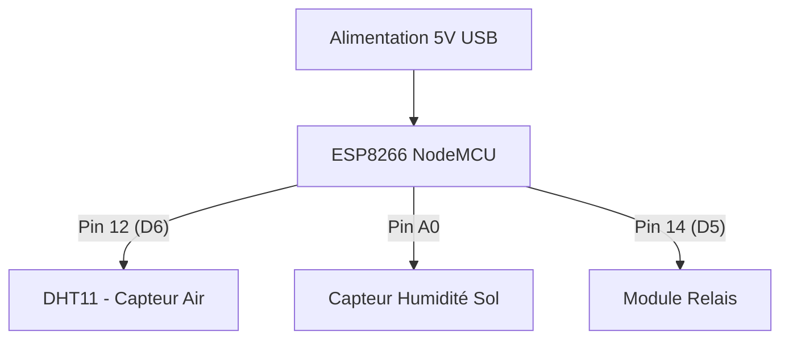

## 1. Vue d'ensemble
Le projet **Agrisense** est un système de monitoring agricole intelligent basé sur l'ESP8266. Il permet de mesurer en temps réel la température, l'humidité de l'air et l'humidité du sol, tout en contrôlant une électrovanne à distance via Firebase Realtime Database. L'architecture repose sur une synchronisation bidirectionnelle (streaming) pour une réactivité immédiate aux commandes utilisateur.

## 2. Composants Hardware
| Composant | Pin | Fonction | Notes |
|-----------|-----|----------|-------|
| ESP8266 (NodeMCU) | - | Microcontrôleur | Gestion WiFi et logique globale |
| DHT11 | 12 (D6) | Température & Humidité Air | Capteur numérique |
| Capteur Humidité Sol | A0 | Humidité du sol | Lecture analogique (0-1023) |
| Module Relais | 14 (D5) | Électrovanne | Contrôle de l'irrigation |

## 3. Configuration des Pins
Extraits du fichier `src/main.cpp` :
- `#define DHT_PIN 12` (Ligne 14) : Capteur DHT11 connecté sur D6.
- `#define SOIL_MOISTURE_PIN A0` (Ligne 16) : Capteur d'humidité du sol.
- `#define RELAY_PIN 14` (Ligne 17) : Relais de l'électrovanne sur D5.

## 4. Bibliotheques
Liste issue de `platformio.ini` et `src/main.cpp` :
- `ESP8266WiFi.h` : Gestion de la pile réseau WiFi.
- `DHT.h` : Protocole de communication avec le capteur DHT.
- `Firebase_ESP_Client.h` (v4.4.17) : Client pour Firebase RTDB et authentification.
- `time_utils.h` : Gestion de la synchronisation temporelle NTP.
- `secrets.h` : Stockage des identifiants (WiFi, API Key, URL Firebase).

## 5. Logique du Code
- **setup()** : Initialise les périphériques, connecte le WiFi, synchronise l'heure via NTP et établit la connexion Firebase. Le relais est forcé à `HIGH` (fermé) par défaut (Ligne 281).
- **loop()** : Maintient la connexion WiFi/Firebase, écoute les changements d'état du relais via `readStream` et déclenche `readMeasures` toutes les 5 secondes.
- **streamCallback()** (Ligne 253) : Fonction critique qui intercepte les modifications de la clé `etat_electrovanne` dans Firebase pour actionner le relais instantanément.
- **updateDataBase()** (Ligne 206) : Envoie les mesures actuelles et gère l'historisation des données toutes les 30 secondes.

## 6. Schema de Cablage

## 7. Installation
1.  **Environnement** : Utiliser PlatformIO sous VS Code avec l'environnement `esp12e`.
2.  **Configuration** : Créer un fichier `include/secrets.h` et y définir `WIFI_SSID`, `WIFI_PASSWORD`, `API_KEY`, `DATABASE_URL`, `USER_EMAIL` et `USER_PASSWORD`.
3.  **Bibliothèques** : Les dépendances sont gérées automatiquement par le fichier `platformio.ini`.
4.  **Firebase** : Créer une Realtime Database et activer l'authentification par Email/Mot de passe.
5.  **Upload** : Connecter l'ESP8266 et lancer la compilation/téléchargement.

## 8. Tests et Depannage
- **Moniteur Série** : Vérifier que le message "Firebase initialisé avec succès" apparaît à 115200 baud.
- **Bug Critique** : Inversion de logique du relais. Le code utilise `digitalWrite(RELAY_PIN, RELAY_STATE ? LOW : HIGH)`. Si votre relais est "Active High", l'état sera inversé.
- **Bug Avertissement** : Précision du DHT11. Ce capteur a une marge d'erreur de ±2°C. Pour plus de précision, remplacez par un DHT22 (Ligne 15).
- **Bug Avertissement** : Oxydation du capteur de sol. La lecture continue sur A0 (Ligne 188) accélère l'électrolyse des sondes. Il est conseillé d'alimenter le capteur via un pin digital uniquement lors de la mesure.

## 🛒 Liste de Courses

| Composant | Prix (USD) | Liens d'Achat | Alternatives |
|-----------|-------------|----------------|---------------|
| **DHT22** | **$9.95** | [Adafruit ($9.95)](https://www.adafruit.com/product/386) • [eBay ($6.99)](https://www.ebay.com/itm/325780517904) | DHT11, AM2302 |
| **ESP32** | **$12.99** | [eBay ($12.99)](https://www.ebay.com/itm/354716962383) • [AliExpress ($19.80)](https://www.aliexpress.com/item/1005006093510007.html) | ESP32-S2, ESP32-S3 |
| **ESP8266** | **$1.86** | [eBay ($1.86)](https://www.ebay.com/itm/374828695574) • [Arduino Store ($10.00)](https://store.arduino.cc/products/nodemcu-esp8266) | NodeMCU ESP8266, ESP-01S |
| **Relay Module** | **$4.99** | [eBay ($4.99)](https://www.ebay.com/itm/204285434199) • [Robocraze ($0.83)](https://robocraze.com/products/1-channel-5v-active-low-relay-module) | 1-Channel Relay Module, 2-Channel Relay Module |

**💰 Total Estimate: ~$29.79**