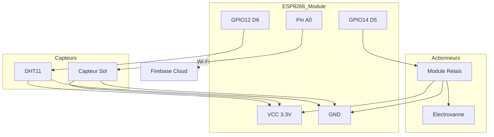

# Agrisense - Partie IoT

Système de surveillance et de contrôle automatisé pour l'agriculture, basé sur ESP8266, capteurs environnementaux et Firebase.

## 📋 Vue d'ensemble

Ce projet implémente un système IoT agricole pour :
- **Surveillance en temps réel** : Température, humidité de l'air, humidité du sol
- **Contrôle automatisé** : Gestion d'une électrovanne via relais
- **Communication cloud** : Firebase Realtime Database pour données et commandes
- **Synchronisation horaire** : NTP pour timestamps précis

### Architecture

**Hardware** : ESP8266 (ESP-12E), DHT11, capteur d'humidité sol, module relais, électrovanne  
**Software** : Arduino Framework, Firebase Client Library, gestion Wi-Fi et NTP

---

## 🔌 Composants Hardware

| Composant | Pin ESP8266 | Fonction | Notes |
|-----------|-------------|----------|-------|
| ESP8266 (ESP-12E) | N/A | Microcontrôleur principal | |
| DHT11 | D6 (GPIO12) | Température et humidité air | Pull-up intégré |
| Capteur humidité sol | A0 | Humidité du sol (analogique) | Valeur 0-1023 |
| Module Relais | D5 (GPIO14) | Commande électrovanne | LOW = actif |
| Électrovanne | N/A | Contrôle flux d'eau | Via relais |

---

## ⚙️ Configuration des Pins

Dans `src/main.cpp` :

```cpp
#define DHT_PIN 12              // GPIO12 (D6)
#define DHT_TYPE DHT11          
#define SOIL_MOISTURE_PIN A0    // Entrée analogique
#define RELAY_PIN 14            // GPIO14 (D5)
```

**Logique du relais** : `LOW` = électrovanne ouverte, `HIGH` = fermée

---

## 📚 Bibliothèques Requises

### Dépendances principales
- `ESP8266WiFi.h` - Gestion Wi-Fi
- `DHT.h` - Capteur DHT11/DHT22
- `Firebase_ESP_Client.h` - Communication Firebase (v4.4.17)
  - `addons/TokenHelper.h`
  - `addons/RTDBHelper.h`

### Fichiers personnalisés
- `time_utils.h` - Synchronisation NTP
- `secrets.h` - **Identifiants (ne pas commiter)**
- `Array_Utils.h` - Utilitaires tableaux

---

## 🚀 Installation

### 1. Configuration IDE

**Option A : PlatformIO (recommandé)**
```bash
# Dans VS Code avec extension PlatformIO
pio run              # Compiler
pio run -t upload    # Téléverser
pio run -t monitor   # Moniteur série
```

**Option B : Arduino IDE**
1. Installer le gestionnaire ESP8266 : `http://arduino.esp8266.com/stable/package_esp8266com_index.json`
2. Installer bibliothèques via Gestionnaire : `DHT sensor library`, `Firebase Arduino Client`

### 2. Identifiants Firebase

Créer `secrets.h` à la racine :

```cpp
#ifndef SECRETS_H
#define SECRETS_H

// Wi-Fi
const char* WIFI_SSID = "VotreSSID";
const char* WIFI_PASSWORD = "VotreMotDePasse";

// Firebase
const char* API_KEY = "VotreAPIKey";
const char* DATABASE_URL = "https://votre-projet.firebaseio.com";
const char* USER_EMAIL = "votre@email.com";
const char* USER_PASSWORD = "motdepasse";

#endif
```

**⚠️ IMPORTANT** : Ajouter `secrets.h` au `.gitignore`

### 3. Configuration Firebase

1. Créer projet sur [Firebase Console](https://console.firebase.google.com)
2. Activer **Realtime Database**
3. Activer authentification **Email/Password**
4. Récupérer **API Key** (Project Settings > General)
5. Noter l'**URL** de la Realtime Database

---

## 💻 Logique du Code

### `setup()`
1. Initialisation série (115200 bauds)
2. Initialisation DHT et GPIO
3. Connexion Wi-Fi (timeout 15s → reboot si échec)
4. Synchronisation NTP
5. Connexion Firebase + démarrage du stream
6. Initialisation historique

### `loop()`
1. **Vérification Wi-Fi** : Reconnexion automatique si perte
2. **Vérification Firebase** : Réinitialisation si déconnecté
3. **Stream Firebase** : Écoute des commandes électrovanne
4. **Mesures capteurs** : Toutes les 5 secondes
5. **Envoi Firebase** : Données + historique (30s)
6. **Contrôle relais** : Application changements d'état

### Fonctions critiques

- `initializeFirebase()` - Authentification et configuration
- `startFirebaseStream()` - Écoute `/etat_electrovanne`
- `streamCallback()` - Réception commandes temps réel
- `updateDataBase()` - Envoi mesures vers Firebase
- `handleRelayStateChange()` - Pilotage physique relais
- `checkWiFiConnection()` - Résilience réseau

---

## 🔧 Tests et Dépannage

### Checklist Hardware
- [ ] Toutes les connexions GPIO vérifiées
- [ ] Alimentation stable (ESP: 3.3V, Relais: 5V)
- [ ] DHT11 correctement câblé (VCC, GND, Data)
- [ ] Capteur sol testé (valeur change dans l'eau)
- [ ] Relais testé indépendamment

### Moniteur Série (115200 bauds)
```
[DEBUG] Connexion WiFi...
[DEBUG] Firebase initialisé
[DEBUG] Stream démarré sur /etat_electrovanne
[DEBUG] Temp: 24.5°C, Hum: 60%, Sol: 45%
```

### Erreurs Fréquentes

| Erreur | Cause | Solution |
|--------|-------|----------|
| Échec Wi-Fi | SSID/mot de passe incorrect | Vérifier `secrets.h` |
| Firebase 401/403 | Authentification échouée | Vérifier credentials Firebase |
| Relais inactif | Logique inversée | Tester `LOW`/`HIGH` manuellement |
| NaN capteurs | Câblage DHT | Vérifier pull-up et connexions |
| Stream déconnecté | Connexion instable | Code gère reconnexion auto |

---

## 📊 Schéma de Câblage



---

## 📖 Structure Firebase

```
{
  "mesures_actuelles": {
    "temperature": 24.5,
    "humidite_air": 60,
    "humidite_sol": 45,
    "etat_electrovanne": true,
    "timestamp": "2024-01-30T15:30:00Z"
  },
  "historique": {
    "temperatures": [24.5, 24.3, ...],
    "humidites_air": [60, 61, ...],
    "humidites_sol": [45, 47, ...],
    "timestamps": ["2024-01-30T15:00:00Z", ...]
  },
  "etat_electrovanne": true
}
```

---

## 🔒 Sécurité

1. **Ne JAMAIS commiter** `secrets.h`
2. Utiliser des règles Firebase strictes en production
3. Changer les mots de passe par défaut
4. Désactiver le mode test avant déploiement

**Règles Firebase recommandées** :
```json
{
  "rules": {
    ".read": "auth != null",
    ".write": "auth != null"
  }
}
```

---

## 📝 Licence

[Spécifier la licence du projet]

## 🤝 Contribution

Les contributions sont les bienvenues ! Créez une issue ou une pull request.

## 📧 Contact

[Vos informations de contact]

---

**Note** : Ce projet est conçu pour un environnement de test. Adaptez les seuils et la logique selon vos besoins agricoles spécifiques.
